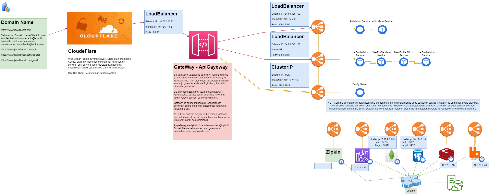

# GENEL İÇERİK VE NOTLAR

## Docker file oluşturulması gerekli.

## Docker Kullanımları.
    docker run --name postgreDocker -e POSTGRES_PASSWORD=root -p 9999:5432 -d postgres

## Microservis ya da Projenin jar olarak export edilmesi

    1- öncelikle ilgili misroservis in gradle dosyası üzerinde build gradle yapmanız gereklidir.
    2- sonra aynı konumda iken buildDependents yapmanız gereklidir.
    Detaylar:
        * Bu işlemlerden sonra ilgili microservis altına build adında bir kalsör gelecektir.
          bu kalsör altında bulunan libs klasörünün altında proje isimlendirmeniz ve versiyonun 
          olduğu bir jar dosyayı bulacaksınız. Bu jar dosyası çalıştırılabilir bir dosyadır.

## Docker Image Oluşturma

    öncelikle, projenizin üzerinde çalışacağı mavcut bir container a ihtiyaç var. Bu nedenle
    bizim sistemimize uygun olan bir dockerImage seçmemiz gerekiyor.
    * bize uygun olan image JavaJDK17 olacaktır. (amazoncorretto:17)
    * kendi jar dosyanızı bu image üzerine kopyaloyorsunuz.
    * OPSİYONEL!! her image genellikle eski paketleri içerir. bu nedenle updade edilmesi tavsiye edilir.
    * jar dosyanızı çalıştırırsınız. (belli sistem environment larını belirlemeniz gerekebilir.)
    Not: Dockerfile oluşturmanın ve kullanmanın 2 yolu var. 
        1- Dockerfile microservice içine oluşturulur ve çalıştırılır. güncellemek ve düzenlemek zor olabilir
        kodlama yaparken ilgili kalsörün içinde olduğunuzdan emin olmanız gerekiyor.
        2- Dockerfile projenin root klasörüne oluşturulur ve çalıştırılır. burada ise, tek dosya üzerinden
        çalışıldığı için güncelleme yapmak kolay olur. ancak, her microservis için ayrıca klasör konumunu
        belirtmek gerekiyor.

## Docker Image Oluşturma (Dockerfile)

        1- docker build -t <image_name> . : dockerfile üzesrinden gerekli yapılandırmalara bakarak 
        image oluşturur. ancak bizim yapımızda ARG olduğu için bu şekilde çalışmaz.
        2- docker build --build-arg JAR_FILE=<jar_file_name> -t <image_name> . : bu şekilde çalışır.

### Auth-Microservice Build İşlemi

        docker build --build-arg JAR_FILE=auth-microservice/build/libs/auth-microservice-v.0.0.1.jar -t java4/authservice:v001 .
        docker run -p 9090:9090 -d java4/authservice:v002
        docker run -p 9090:9090 -d -e AUTH_PORT=9090 java4/authservice:v002

### Config-Server Build İşlemi

        docker build --build-arg JAR_FILE=config-server/build/libs/config-server-v.0.0.1.jar -t java4/configserver:v002 .
        docker run -p 8888:8888 -d java4/configserver:v002

## Karşılaşılan sorunlar ve çözüm yolları

    - Microservis içinde eğer Environment variable ları kullanıyorsanız, docker run yaparken mutlaka
      bu parametreleri girmeniz gereklidir. ÖRN: -e AUTH_PORT=9090 şeklinde port ortam değişkeni olarak eklenmeli

    - localhost olarak bırakılan tüm konumlar, container içinde aranacağı için hataya neden olmaktadır. 
    Burada yapmanız gereken şey, ulaşmak istediğiniz ip adresini tam olarak yazmaktır.
    ÖRN: localhost:5432 yerine 192.168.1.26:5432 şeklinde yazmanız gerekiyor.
         localhost:8888 yerine 192.168.1.26:8888 şeklinde yazmanız gerekiyor.

    - PostgreSQL in güvenlik önlemi olarak locahost dışında tüm erişimlere kendisini kapatmasıdır. bu nedenle,
    localhost yerinde ip adresi kullandığınızda erişimi reddetmektedir. bu nedenle, 
    C:\Program Files\PostgreSQL\14\data\ pg_hba.conf dosyasında düzenleme yapmanız gerekiyor. aşağıdaki şekilde
    gerekli dzületmeyi yapınız.

    # TYPE  DATABASE        USER            ADDRESS                 METHOD

    # "local" is for Unix domain socket connections only
    local   all             all                                     scram-sha-256
    # IPv4 local connections:
    host    all             all             127.0.0.1/32            scram-sha-256
    # IPv6 local connections:
    host    all             all             ::1/128                 scram-sha-256
    # Allow replication connections from localhost, by a user with the
    # replication privilege.
    local   replication     all                                     scram-sha-256
    host    replication     all             127.0.0.1/32            scram-sha-256
    host    replication     all             ::1/128                 scram-sha-256
    host    all  	      all 		    0.0.0.0/0 		    md5

# MongoDB Docker kullanınımı hakkında

### Docker üzerinde çalıştırmak.
    docker run --name localdockermongo -e MONGO_INITDB_ROOT_USERNAME=root -e MONGO_INITDB_ROOT_PASSWORD=root -p 27000:27017 -d mongo:4.2.23

### Docker üzerindeki mongoDB ye bağlanmak.
    MongoDb Compass kullanarak bağlanabilirsiniz. Yeni bağlantı yaparak,
    localhost:27000 adresini kullanarak bağlanabilirsiniz.
    auth kısmında -> username: root, password: root şeklinde bağlanabilirsiniz.
    databasename boş bırakılacak.
    DİKKAT!!!
    MongoDB de bir veritabanına erişim Root kullanıcı ile yapılmaz. default ta 
    kullanıcı yeni eklenen DB ye yönetici olarak eklenmez. ve root şifresi ile erişim
    doğru değildir. bu nedenle her DB için yetkili bir kullanıcı oluşturmak gereklidir.
    Kullanıcı oluşturma işlemi için Mongo Compass kullanılabilir.
    1- use [DB ADI] - springMsMaD87
    2- db.createUser({
            user: "JavaUser",
            pwd: "Aa123456",
            roles: [ "readWrite", "dbAdmin"]
            })
    NOT: Böyle yapıştırın: db.createUser({user: "JavaUser",pwd: "Aa123456",roles: [ "readWrite", "dbAdmin"]})
    3- bu işlemlerden sonra mutlaka yeni oluşturduğunuz kullanıcı ile bağlatıyı deneyin.

# ZİPKİN Server docker üzerinde çalıştırmak ve ayarlamalar

    docker run -d -p 9411:9411 openzipkin/zipkin

    1- Gerekli bağımlılıklar genel build.gradle a eklenir.
    2- application.yml içinde zipkin ayarları yapılır.
      zipkin:
        enabled: true
        base-url: http://localhost:9411
        service:
          name: config-server

# REDIS server kullanımı

     docker run --name localredis -d -p 6379:6379 redis

    1- Öncelikle bağımlılıkları ekliyoruz. DİKKAT tüm sisteme değil kullanacak servisltere ekleyin.
    2- redis için bir config dosyayı yapılandırmalsısınız.
    3- 
    @Configuration
    @EnableCaching // redis üzerinde kullanmak üzere spring cache in aktif edilmesi içni gereklidir.
    @EnableRedisRepositories
    public class RedisConfiguration {    
        @Bean
        public LettuceConnectionFactory redisLettuceConnectionFactory(){
            return new LettuceConnectionFactory(new RedisStandaloneConfiguration("localhost",6379));
        }    
    }

# ElasticSearch Kurulumu ve Kullanımı

    1- Gerekli bağımlılıklar tanımlanır ve eklenir.
    2- ElasticSearch için sonraki adım spring.io dökümantasyonu okunmalıdır. çünkü hangi spring boot versiyonunun
    hangi elasticSearch versiyonu ile uyumlu olduğu bilinmelidir. 
    3- Elasticsearch kullanımı için ayrı bir modül oluşturmak çok daha mantıklıdır.
    4- ilgili elasticsearch docker imajı kurulur.
     *  docker network create somenetwork
     *  docker run -d --name elasticsearch --net somenetwork -p 9200:9200 -p 9300:9300 -e "discovery.type=single-node" -e ES_JAVA_OPTS="-Xms1024m -Xmx2048m" elasticsearch:7.17.7
    NOT:Xms ve Xmx kullanacağı ram aralığını belirler eğer kısıtlama koymazsan 26gm'a kadar çıkar. -p 9300:9300 ise kibana ui için gereklidir.
    5- ElasticSearch için bir application.yml dosyasına ilgili parametereler yazılır.
    spring:
     elasticsearch:
        uris: http://localhost:9200
    6- Eğer elasticsearch için data analiz yapcaksanız, verilerinizi kontrol edecek iseniz
    kibana kurmanız tavsiye edilir.
     * docker run -d --name kibana --net somenetwork -p 5601:5601 kibana:7.17.7

# GraphQL KUllanımı

    graphqls dosyası içinde tanımlanan datatype larda ! işareti zorunlu tanımlı
    alanları belirtir (null olamaz). ! işareti olmayan alanlar null olabilir.

# Docker Image larının Upload Edilmesi

    Docker Desktop üzerinde oluşturulan imajlarınızı, Docker Hub a push etmek için öncelikle hub hesabınızı
    web üzerinden açınız, sonra dcker desktop üzerinden login olmayı denediğinizde otomatik sizi yönlendirecek
    ve hesabınızı açacaktır. Ardından docker.hub a göndermek istediğiniz image ın  sağtarafında bulunan 
    3 noktaya basarak "push" butonuna basmanız yeterlidir. Bu işlem image boyutuna göre uzun sürebilir.
    sonraki yüklemeleriniz, daha kısa sürecektir.

# RabbitMQ Docker kurulumu

    docker run -d --name some-rabbit -e RABBITMQ_DEFAULT_USER=java4 -e RABBITMQ_DEFAULT_PASS=root -p 5672:5672 -p 15672:15672 rabbitmq:3-management
    1- RabbitMQ arayüzüne erişim için http://localhost:15672/ adresine gidilir.
    2- Java içinden api desteği ve erişim için post olarak 5672 kullanılır.